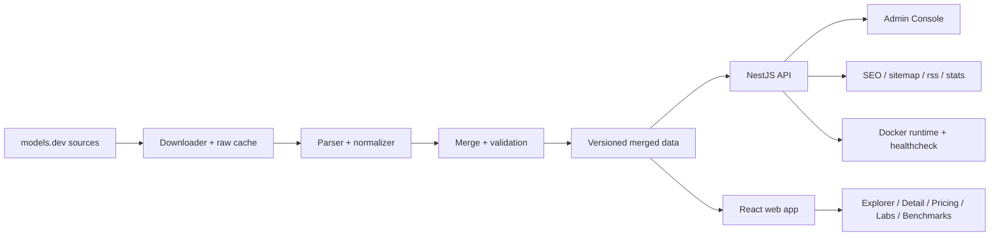

# Final Review

## Completed

- Real data snapshots captured for API, catalog, and labs sources.
- Normalized schema, merge strategy, validation, quarantine, and versioned pipeline are implemented.
- Public API, Swagger docs, filters, stats, SEO endpoints, and same-origin SPA serving are live.
- Explorer, Model Detail, Pricing Compare, Dashboard, Labs, Benchmark Compare, command palette, and Admin Console are implemented.
- i18n, dark/light/system theme, responsive layouts, URL-driven state, and compare flows are implemented.
- Deployment artifacts exist: `.env.example`, Dockerfile, docker-compose, CI, and runbooks.
- Engineering gates now exist in the repo: `lint`, `format:check`, `typecheck`, `test`, `build`, `api test:e2e`, `web build`, Docker image build, and Docker compose smoke verification.

## Incomplete

- No explicit incomplete product requirement remains in the implementation set that was part of the prompt.

## Known Limits

- Some upstream records still do not provide `architecture` or `license`; the UI shows `-` rather than inventing values.
- Related models are derived from same lab/family grouping, not from an explicit upstream relationship field.
- Docker deployment uses the local data volume and refresh flow; external network access is still required on first boot if the mounted data volume is empty.

## Follow-up Ideas

- Add broader lint coverage for markdown and workflow files if the repository keeps expanding.
- Add more targeted browser regression snapshots if new UI surfaces are introduced.
- Consider a fuller docs site or generated API reference if the schema evolves significantly.

## Architecture

## Key Decisions

- Keep the shared schema in `packages/shared` so API and web consume one source of truth.
- Keep compare state and filter state in the URL so pages are shareable and reload-safe.
- Use virtualized pricing rows because the row count can grow large while still preserving a fixed left column.
- Use Docker compose with a single service and a mounted data volume so deployments stay simple.
- Keep admin paths isolated from public navigation, sitemap, and robots.

## TIMELOG Summary

- `TIMELOG.md` records the continuation history and reconstructed token estimates.
- Goal metadata currently reports 9,485,138 tokens used.
- Current continuation entry records the lint/format/Husky/dev-entrance work plus Docker verification and final review updates.
