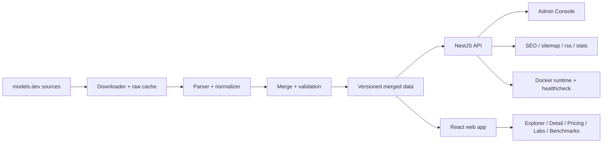

# 最终 Review

## 已完成

- 已抓取 API、catalog、labs 三个真实数据源快照。
- 已实现统一 schema、merge 策略、校验、隔离区与版本化数据管线。
- 已实现公开 API、Swagger 文档、filters、stats、SEO 端点与同源 SPA 服务。
- 已实现 Explorer、Model Detail、Pricing Compare、Dashboard、Labs、Benchmark Compare、命令面板与 Admin Console。
- 已实现 i18n、dark/light/system 三态主题、响应式布局、URL 状态与对比流转。
- 已补齐部署资产：`.env.example`、Dockerfile、docker-compose、CI 与部署 Runbook。
- 仓库内已有工程门禁：`lint`、`format:check`、`typecheck`、`test`、`build`、`api test:e2e`、`web build`、Docker image build 与 Docker compose 冒烟验证。

## 未完成

- 当前 prompt 范围内没有明确剩余的产品功能缺口。

## 已知限制

- 部分上游记录仍不提供 `architecture` 或 `license`，前端如实显示 `-`，不补造字段。
- Related models 基于同 lab / 同 family 派生，不来自上游显式关系字段。
- Docker 部署使用本地数据 volume 与 refresh 流程；如果挂载的数据 volume 为空，首次启动仍需要外网访问上游数据源。

## 后续建议

- 如果仓库继续扩张，可把 lint 覆盖面扩展到 Markdown 与 workflow 文件。
- 新增 UI 页面时，可补更细的浏览器截图回归。
- 如果 schema 继续演进，可考虑生成更完整的文档站或 API reference。

## 架构图

## 关键设计决策

- 共享 schema 放在 `packages/shared`，API 与 web 使用同一事实源。
- 对比状态与筛选状态写入 URL，保证页面可分享、可刷新恢复。
- Pricing 表格采用虚拟滚动，在行数增长时仍保留固定左侧列体验。
- Docker compose 保持单服务 + 数据 volume，降低部署复杂度。
- Admin 路径隔离于公开导航、sitemap 与 robots。

## TIMELOG 汇总

- `TIMELOG.md` 记录了 continuation 历史与重建的 token 估算。
- Goal metadata 当前记录 token 用量为 9,485,138。
- 当前 continuation 记录了 lint/format/Husky/dev 入口补齐、Docker 验证与最终 Review 更新过程。
